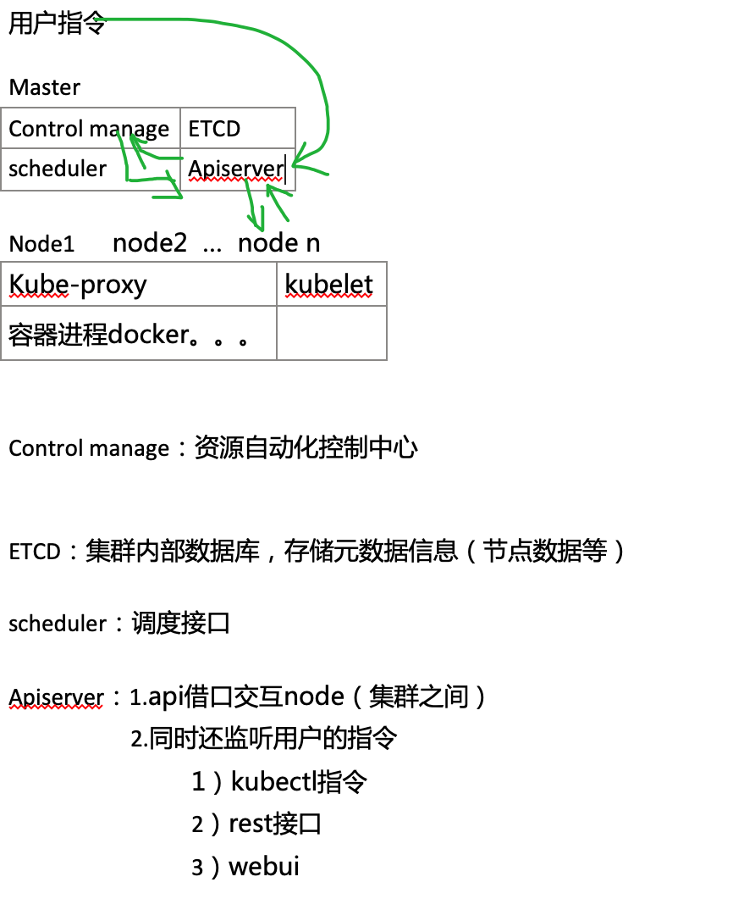
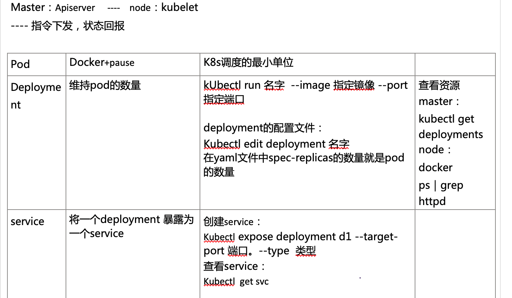
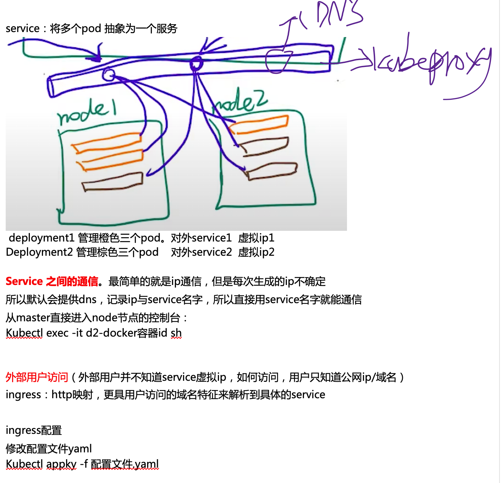

# Kubernetes

课程资料:

课程地址:

https://gooyo-my.sharepoint.com/:f:/g/personal/stay_tontonnoton_com/EqhQk1vRoOtJr9C_uTO53hQBtwoYaUZUt2FUocPSAgJkzA

官方文档:

https://kubernetes.io/zh/docs/home/

课程进度:

| 课程节点             | 完成时间 | 备注 |
| -------------------- | -------- | ---- |
| 1-1K8s架构师课程介绍 |          |      |
|                      |          |      |
|                      |          |      |
|                      |          |      |
|                      |          |      |

## 0.初识K8S

  

 配置ing-conf.yaml文件（具体域名ip映射设置 ）

Kubectl apply -f ing-conf.yaml 设置生效

## 1.安装

### 1.Kubeadm[^1]

### 2.二进制

## 2.基础

## 3.进阶

## 4.高级

## 5.运维

## 注解

[^1]:(Kubeadm规模越大,性能瓶颈明显)