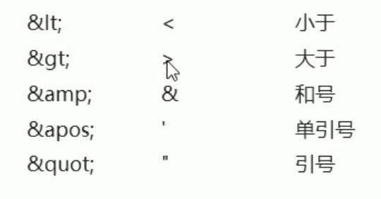

##   1.Java基础

### 12.基础加强

#### 2.XML

**xml **：可扩展标记语言，通过标签来描述数据，标签可以自定义

作用：

+ 可用于存储数据和传输数据

+ 作为软件的配置文件

  ---

**xml标签**

+ 标签由一对尖括号和合法标识服组成。  <student>

+ 标签必须成对出现。  <student></student>

+ 特殊标签可以不成对，但是必须有结束标记 <address/>

+ 标签中可以定义属性，属性和标签名空格隔开属性值必须要引号引起来<student id="1"> </student>

+ 标签必须正确嵌套。 <a><b></b></a>

  ---

**XML** 语法规则：

+ 后缀为*xml*

+ 文档声明必须在*第一行第一列*  <?xml version= "1.0" encoding= "UTF-8" standalone= "yes" ?>    standalone当前xml是否独立是否依赖其它的xml

+ 必须有且只有一个*根标签*

+ XML文件中可以定义注释信息

+ XML文件中可以存在以下特殊字符 （用来代替xml中使用的语法字符 ）

+ XML中可以存在CDATA区

  <![CDATA[...内容...]]>

  ---

**XML DOM解析**


---

**XML常见的解析工具**


**DOM4J解析练习**


```xml
<students>
    <student id="1">
        <name>张三</name>
        <age>23</age>
    </student>

    <student id="2 ">
        <name>李四</name>
        <age>24</age>
    </student>

    <aaa></aaa>

</students>
```

**使用dom4j,解析如上xml**

1.获取一个解析器

```java
SAXReader saxReader = new SAXReader();
```

2.利用解析器将xml文件加载到内存，并返回一个文档对象

```java
Document document = saxReader.read(new File("/Users/zhaobo/onedrive/Code/java_workspace/heima2021/xml/student.xml"));
```

3.开始着层解析

+ 获取根标签	**getRootElement()**

```java
Element rootElement = document.getRootElement();
```

+ 获取标签下所有叫***student***的标签	elements("student")[^1]

```java
List<Element> studentsElements = rootElement.elements("student");
```

+ 所有为***student***的标签都存放到studentsElements里了,对其进行遍历

  

  

  >for (Element element : studentsElements) {
  >
  >>Attribute attribute = element.attribute("id");    //获取指定的属性
  >>
  >>String id = attribute.getValue();      //获取该属性的值
  >
  >>Element nameElement = element.element("name");   //接着获取子标签
  >>
  >>String name = nameElement.getText();         //获取该标签的内容
  >
  >}

  ```xml
  <student id="1">        	--id为属性
      <name>张三</name>			--name为子标签
  </student>               --上文中的element为一个student标签
  ```

  ```java
  element.attribute("id"); //获取属性的方法
  element.element("name");  //获取子标签的方法
  ```


#### 3.XMl约束:DTD&schema

##### 1.DTD约束


*person+ : 表示persons的子元素person只能出现一次或者多次*


xml文件引入DTD约束

```xml-dtd
<!DOCTYPE persons SYSTEM 'DTD文件路径'>
##persons:根标签
##SYSTEM:说明使用的是本机DTD文件
```

###### 1.DTD的语法规则

**1.定义一个元素的格式为**

```xml-dtd
<!ELEMENT 元素名 元素类型>
```


**2.定义一个属性格式为**

```xml-dtd
<!ATTLIST 元素名称 属性信息 属性的类型 属性的约束>
```

 

###### 2.引入DTD约束的三种方法

+ 引入本地dtd

  ```xml-dtd
  <!DOCTYPE 根标签名 SYSTEM '本地dtd路径'>
  ```

+ 在xml内部引入

  ```xml-dtd
  <!DOCTYPE 根标签名 [
      直接写dtd内容
    ] '本地dtd路径'>
  ```

+ 引入网络dtd

  ```xml-dtd
  <!DOCTYPE 根标签	PUBLIC "dtd文件的名称""dtd文档的URL">
  ```

##### 2.schema约束

###### 

##### 3.schema和dtd的区别

| 名称 | schema                                                       | dtd                            |
| ---- | ------------------------------------------------------------ | ------------------------------ |
|      | 自身也是一个xml文件,符合xml语法,后缀名.xsd                   | dtd文件                        |
|      | 一个xml中可以引入多个schema文件,多个schema会使用名称空间区分 |                                |
|      | schema里面支持很多种数据类型                                 | dtd取值比较单一常见为CDATA类型 |
|      | schema语法更加复杂                                           |                                |


## 2.Javaweb

### 1.linux

主流操作系统：


linux常见的发行商和发行版本:


### 2.HTML+CSS+Nginx

+ Html：用来制作网页的基本内容和结构
+ CSS：用来制作网页的美化效果
+ JavaScript：用来制作网页动态效果

#### 1.HTML 

超文本标记语言，比普通的文本强大的标签语言


## 其它


## 注解

[^1]:elements()没有参数则会返回所有标签

